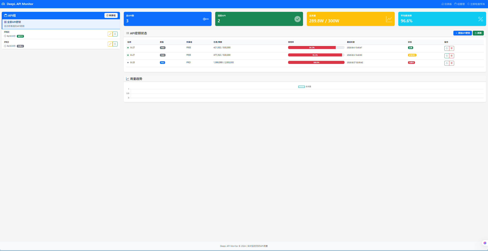

# DeepL API 用量监控系统

买第三方的key怕老板偷跑你额度？这个系统帮你实时监控！

## DEMO



## 功能特性

- 📊 **实时监控** - 自动定期检查 DeepL API 密钥用量
- 👥 **分组管理** - 将 API 密钥按组管理，支持不同的查询频率
- 📈 **用量统计** - 查看历史用量数据和趋势图表
- 🔄 **自动调度** - 后台自动执行用量检查任务
- 🎯 **支持双版本** - 同时支持 DeepL Free 和 Pro API
- 💾 **数据持久化** - 所有数据保存到本地 SQLite 数据库

## 快速开始

### 环境要求

- Python 3.7+
- Flask 2.3.3
- 其他依赖见 `requirements.txt`

### 安装运行

1. **克隆项目**
   ```bash
   git clone <repository-url>
   cd API\ Cost\ Monitor
   ```

2. **安装依赖**
   ```bash
   pip install -r requirements.txt
   ```

3. **运行应用**
   ```bash
   python app.py
   ```

4. **访问系统**
   ```
   http://localhost:5323
   ```

## 使用说明

### 添加 API 密钥

1. 创建 API 组（可设置查询间隔）
2. 在组内添加 DeepL API 密钥
3. 系统会自动识别 Free（以 `:fx` 结尾）和 Pro 版本

### 监控用量

- 系统会根据设置的间隔自动查询用量
- 可在界面查看实时用量和历史趋势
- 支持手动立即检查用量

### API 接口

- `GET /api/usage/summary` - 获取所有密钥用量摘要
- `POST /api/groups` - 创建 API 组
- `POST /api/keys` - 添加 API 密钥
- `GET /api/usage/<key_id>` - 获取指定密钥的用量历史

## 配置选项

编辑 `config.py` 文件：

- `DEFAULT_QUERY_INTERVAL` - 默认查询间隔（秒）
- `SCHEDULER_TIMEZONE` - 调度器时区
- `REQUEST_TIMEOUT` - API 请求超时时间

## 项目结构

```
API Cost Monitor/
├── app.py              # Flask 主应用
├── config.py           # 配置文件
├── models.py           # 数据库模型
├── requirements.txt    # 依赖包列表
├── services/           # 服务层
│   ├── deepl_service.py    # DeepL API 服务
│   └── scheduler_service.py # 调度服务
├── templates/          # HTML 模板
├── static/            # 静态资源
└── instance/          # 数据库文件
```

## 许可证

本项目仅供学习和个人使用。
